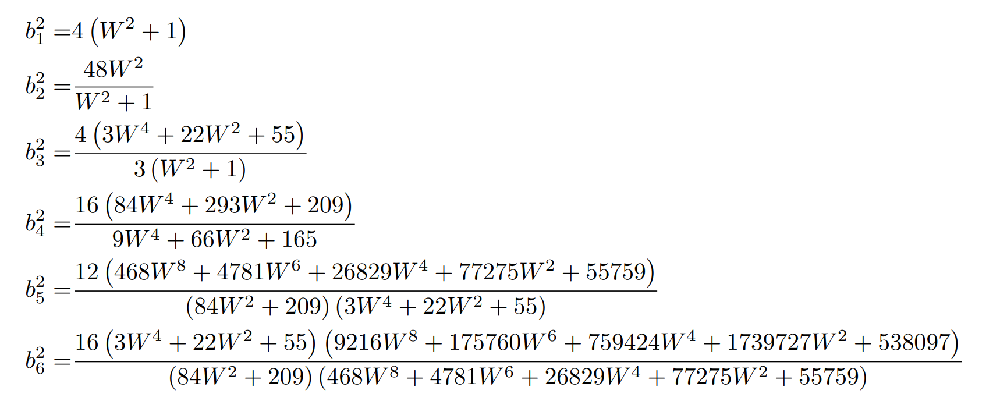

# Symbolic Lanczos
Julia code to compute symbolic Lanczos coefficients of the Saw model from
[Krylov space perturbation theory for quantum synchronization in closed systems]().
## First 6 coefficients



## First 6 coefficients in Mathematica format
```mathematica
Times[2, Power[Plus[1, Power[W, 2]], Rational[1, 2]]]
Times[4, Power[3, Rational[1, 2]], W, Power[Plus[1, Power[W, 2]], Rational[-1, 2]]]
Times[2, Power[3, Rational[-1, 2]], Power[Times[Power[Plus[1, Power[W, 2]], -1], Plus[55, Times[22, Power[W, 2]], Times[3, Power[W, 4]]]], Rational[1, 2]]]
Times[4, Power[Times[Power[Plus[165, Times[66, Power[W, 2]], Times[9, Power[W, 4]]], -1], Plus[209, Times[293, Power[W, 2]], Times[84, Power[W, 4]]]], Rational[1, 2]]]
Times[2, Power[3, Rational[1, 2]], Power[Times[Plus[209, Times[84, Power[W, 2]]], Plus[55, Times[22, Power[W, 2]], Times[3, Power[W, 4]]], Power[Plus[55759, Times[77275, Power[W, 2]], Times[26829, Power[W, 4]], Times[4781, Power[W, 6]], Times[468, Power[W, 8]]], -1]], Rational[-1, 2]]]
Times[4, Power[Times[Power[Plus[209, Times[84, Power[W, 2]]], -1], Plus[55, Times[22, Power[W, 2]], Times[3, Power[W, 4]]], Power[Plus[55759, Times[77275, Power[W, 2]], Times[26829, Power[W, 4]], Times[4781, Power[W, 6]], Times[468, Power[W, 8]]], -1], Plus[538097, Times[1739727, Power[W, 2]], Times[759424, Power[W, 4]], Times[175760, Power[W, 6]], Times[9216, Power[W, 8]]]], Rational[1, 2]]]
```
